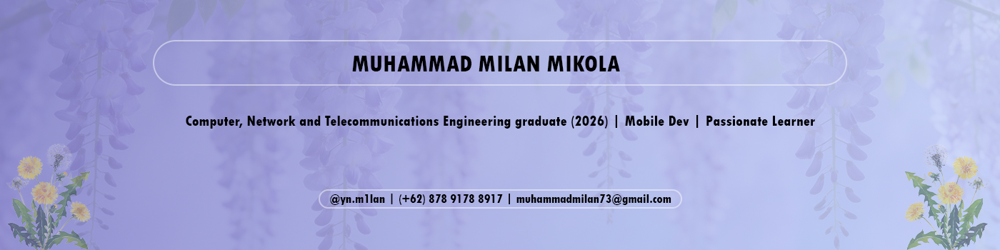

<h2 align="center">Muhammad Milan Mikola</h2>

Computer, Network and Telecommunications Engineering graduate (2026) · Mobile Development · Passionate learner

 

### Connect

&nbsp;

&nbsp;

&nbsp;

&nbsp;

&nbsp;

&nbsp;

&bnsp;

&bnsp;

---

### About Me

- 🎓 Computer, Network and Telecommunications Engineering graduate from SMK Negeri 3 Batam, Batam City, Riau Islands.
- 🇪🇳 Learned English as a second language through YouTube and has taken a test at International Test Center for Toeic resulting in a total score of 985/990
- 📱 Interested in Mobile Development and Full Stack Web Development.

---

### Core Stack

**Mobile Development**
- Flutter
- Dart
- RiverPod
- VS Code

**Web Development**
- React
- NodeJS
- Flask

---

Thanks for visiting.

